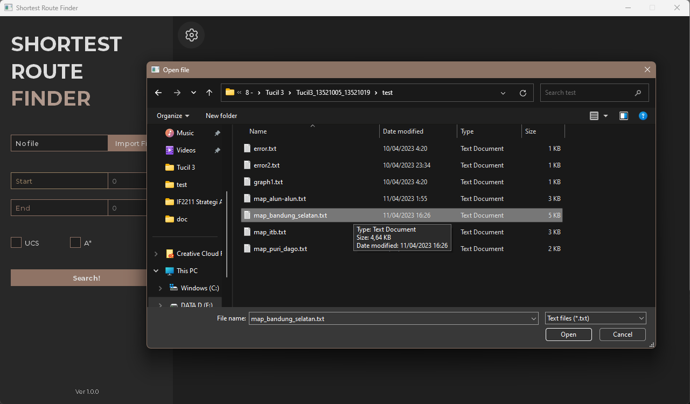
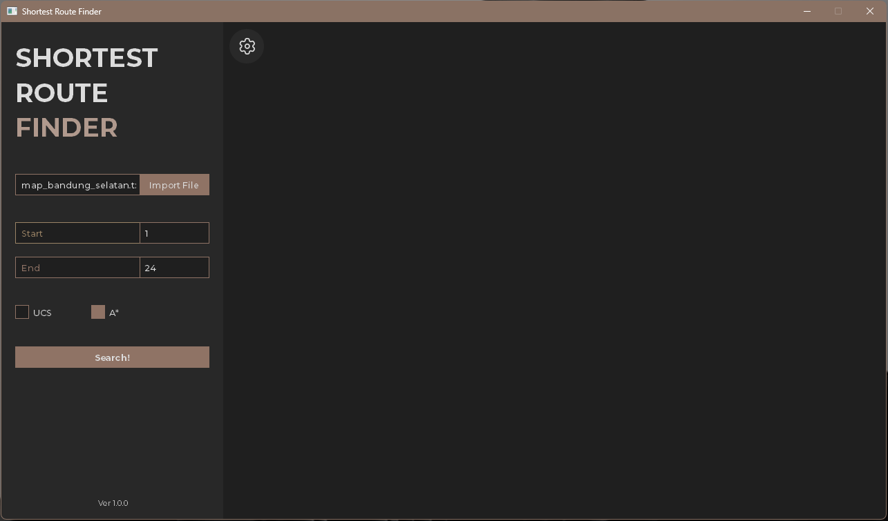
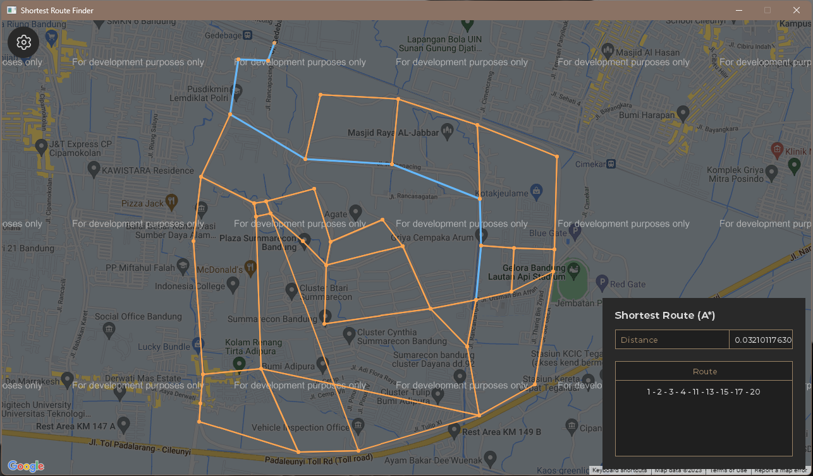

<!-- LOGO -->
<br />
<div align="center">
  <a href="https://github.com/ditramadia/Tucil3_13521005_13521019">
    
  </a>

  <h3 align="center">TUGAS KECIL 3</h3>

  <p align="center">
    IF2211 Strategi Algoritma
    <br />
    <a href="https://github.com/ditramadia/Tucil3_13521005_13521019/blob/main/doc/Tucil3_13521005_13521019.pdf"><strong>Laporan »</strong></a>
    <br />
    <br />
  </p>
</div>

<!-- TABLE OF CONTENTS -->
<details>
  <summary>Table of Contents</summary>
  <ol>
    <li>
        <a href="#about-the-project">About The Project</a>
        <ul>
            <li><a href="#specification">Specification</a></li>
            <li><a href="#built-with">Built With</a></li>
            <li><a href="#project-structure">Project Structure</a></li>
        </ul>
    </li>
    <li>
        <a href="#getting-started">Getting Started</a>
        <ul>
            <li><a href="#prerequisites">Prerequisites</a></li>
            <li><a href="#installation">Installation</a></li>
        </ul>
    </li>
    <li>
        <a href="#usage">Usage</a>
    </li>
    <li>
        <a href="#authors">Author</a>
    </li>
  </ol>
</details>
<br/>
<br/>

<!-- ABOUT THE PROJECT -->
## About The Project

[![Product Name Screen Shot][product-screenshot]](https://github.com/ditramadia/Tucil3_13521005_13521019)

Tucil 3 of Design of Algorithms (IF2211). Shortest Route Finder, a simple application to solve shortest-path problem using Uniform Cost Search (UCS) and A*. 

### Specification

* Program is able to read a graph represented by adjacency matrix from a text file
* Program is able to find the shortest path using UCS algorithm
* Program is able to find the shortest path using A* algorithm
* Program is able to visualize the solution path and distance
* Bonus: Program is able to visualize the solution path using Google Map API

### Built With

* [![Python][Python.py]][Python-url]
* [![HTML][HTML.html]][HTML-url]

### Project Structure
```ssh
.
├─── README.md
├─── test                   # Test files
├─── src                    # Source code
│    ├── asset              # Images
│    ├── uibuilder          # GUI
│    │    └── Main.ui
│    ├── AStar.py
│    ├── Controller.py
│    ├── Graph.py
│    ├── main.py
│    ├── Node.py
│    ├── UCS.py
│    └── Window.py
└───doc                     # Documentation
```
<br/>
<br/>

<!-- GETTING STARTED -->
## Getting Started

### Prerequisites
* gmplot
  ```sh
  pip install gmplot
  ```
* PyQt
  ```sh
  pip install pyqt5
  ```
* matplotlib
  ```sh
  pip install matplotlib
  ```
* networkx
  ```sh
  pip install networkx
  ```
* scipy
  ```sh
  pip install scipy
  ```

### Installation
1. Clone the repo
   ```sh
   git clone https://github.com/ditramadia/Tucil3_13521005_13521019.git
   ```
2. Go to the repository root folder `Tucil3_13521005_13521019`
   ```sh
   cd Tucil3_13512005_13521019
   ```
3. Run the program `main.py`
   ```sh
   python src/main.py
   ```
<br/>
<br/>

<!-- USAGE -->
## Usage

1. Import an existing graph file from `test` folder
    <br/> 
    <br/> 
    <br/> 
    <br/> 
2. Or create your own graph file 
    - Adjacency Cost Matrix 
    ```ssh
    0 0 2000 0 0 0 0 0 0 0 0 0
    0 0 0 2500 0 0 0 0 0 0 0 0
    2000 0 0 1500 800 0 0 0 0 0 0 0
    0 2500 1500 0 1200 1000 0 0 0 0 0 0
    0 0 800 1200 0 900 700 0 0 2000 0 0
    0 0 0 1000 900 0 500 0 0 0 0 0
    0 0 0 0 700 500 0  600 0 0 0 0
    0 0 0 0 0 0 600 0 500 0 0 1500
    0 0 0 0 0 0 0 500 0 300 0 0
    0 0 0 0 2000 0 0 0 300 0 1000 0
    0 0 0 0 0 0 0 0 0 1000 0 0
    0 0 0 0 0 0 0 1500 0 0 0 0
    ```
    - Adjacency Matrix with coordinates 
    ```ssh
    0 1 0 0 0 0 0 0 0 0 0 0 0 0 0 0 0 0 1 -6.91625368796845 107.66807053929479
    1 0 1 0 0 0 0 0 0 0 0 0 0 0 0 0 0 0 0 -6.916462676343243 107.66768777505051
    0 1 0 1 1 0 0 0 0 0 0 0 0 0 0 0 0 0 0 -6.916791991170412 107.66796208942557
    0 0 1 0 0 0 0 0 0 0 0 0 0 0 0 0 0 0 0 -6.917178302501934 107.66786001896044
    0 0 1 0 0 1 1 0 0 0 0 0 0 0 0 0 0 0 0 -6.917317627822643 107.66846606234719
    0 0 0 0 1 0 1 0 0 0 0 0 0 0 0 0 0 0 0 -6.917545614622436 107.66838950949835
    0 0 0 0 1 1 0 1 0 0 0 0 0 0 0 0 0 0 0 -6.917564613517447 107.66858727102455
    0 0 0 0 0 0 1 0 1 1 0 0 0 0 0 0 0 0 0 -6.917969923095667 107.66854261519605
    0 0 0 0 0 0 0 1 0 0 0 0 0 0 0 0 0 0 0 -6.9180079208507905 107.6691933144113
    0 0 0 0 0 0 0 1 0 0 1 1 0 0 0 0 0 0 0 -6.918381565279984 107.66849157996349
    0 0 0 0 0 0 0 0 0 1 0 0 0 0 0 0 0 0 0 -6.918413230048527 107.66925072904795
    0 0 0 0 0 0 0 0 0 1 0 0 1 1 0 0 0 0 0 -6.918805873002069 107.66848520055942
    0 0 0 0 0 0 0 0 0 0 0 1 0 0 0 0 0 0 0 -6.918869202480124 107.66926986726016
    0 0 0 0 0 0 0 0 0 0 0 1 0 0 1 1 0 0 0 -6.919185849742991 107.66844692413497
    0 0 0 0 0 0 0 0 0 0 0 0 0 1 0 0 0 0 0 -6.919135186195209 107.66763673981794
    0 0 0 0 0 0 0 0 0 0 0 0 0 1 0 0 1 0 0 -6.9192935097639925 107.66962711388815
    0 0 0 0 0 0 0 0 0 0 0 0 0 0 0 1 0 1 0 -6.918653882220063 107.66963349329221
    0 0 0 0 0 0 0 0 0 0 0 0 0 0 0 0 1 0 1 -6.917900260536669 107.66953142282708
    1 0 0 0 0 0 0 0 0 0 0 0 0 0 0 0 0 1 0 -6.9174189553028125 107.66920607321946
    ``` 
3. Choose start node, end node, and algorithm to use
    <br/> 
    <br/> 
    <br/> 
    <br/> 
4. Search!
    <br/> 
    <br/> 
    <br/> 
    <br/> 
<br/>
<br/>


<!-- AUTHOR -->

### Authors

| NIM | Name |
| :---: | :---: |
| 13521005 | Kelvin Rayhan Alkarim |
| 13521019 | Ditra Rizqa Amadia |

<!-- MARKDOWN LINKS & IMAGES -->
<!-- https://www.markdownguide.org/basic-syntax/#reference-style-links -->
[product-screenshot]: public/application-preview.png
[Python.py]: https://img.shields.io/badge/python-3670A0?style=for-the-badge&logo=python&logoColor=ffdd54
[Python-url]: https://www.python.org/
[HTML.html]: https://img.shields.io/badge/html5-%23E34F26.svg?style=for-the-badge&logo=html5&logoColor=white 
[HTML-url]: https://developer.mozilla.org/en-US/docs/Web/HTML
